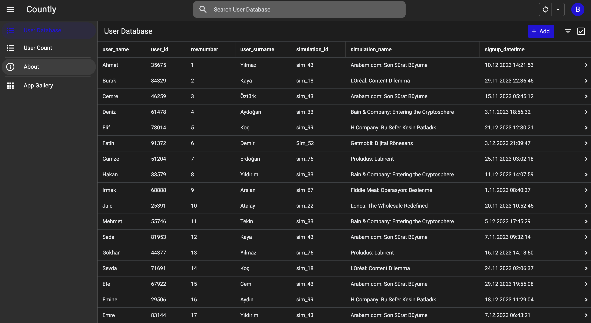
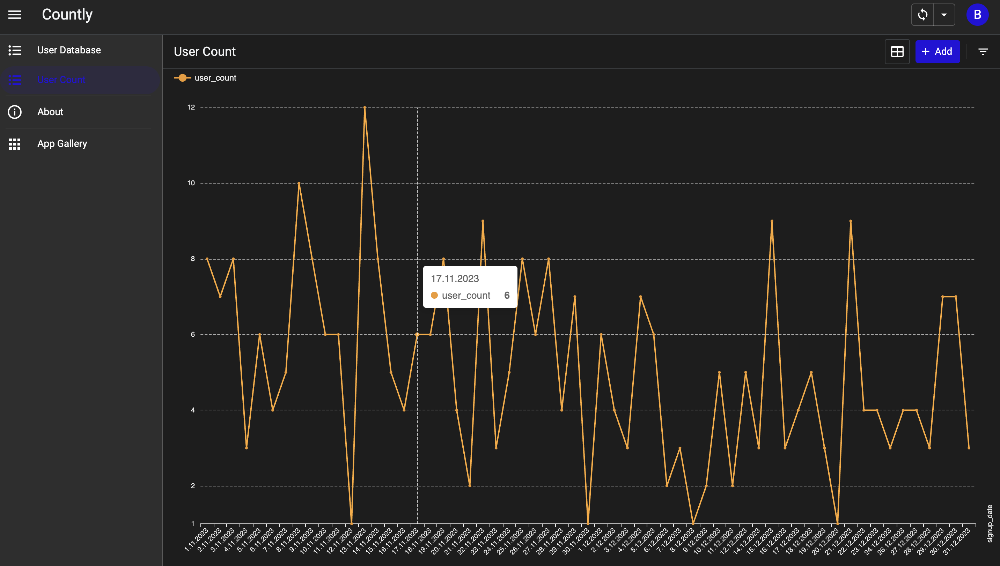
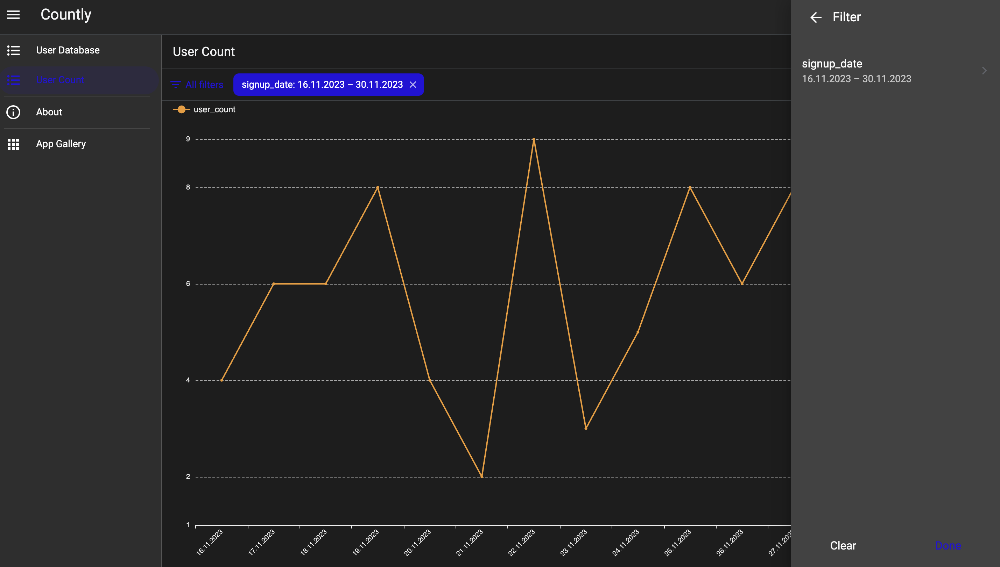

<h1 align="center">📊 Countly — User Analytics Dashboard</h1>

  <em>A minimalist analytics dashboard built with <b>Google AppSheet</b> and <b>Google Sheets</b>.</em> 
  Visualize user signups, analyze growth trends, and explore your data in real time — without writing a single line of code.

---

## 🚀 Overview

**Countly** connects directly to Google Sheets to turn raw user data into a live analytics dashboard.  
It features a database view for detailed information and an interactive chart that updates automatically as new data is added.

> 🧠 Designed for developers, teams, and students who want to explore no-code data visualization.

---

## ✨ Key Features

- 📅 Track daily user signups  
- 📈 Visualize growth with interactive charts  
- 🔄 Real-time sync with Google Sheets  
- 🧮 Filter by custom date ranges  
- 🌙 Clean dark-mode UI  
- 🖥 Works seamlessly on both desktop and mobile  

---

## 📸 Screenshots

### 🧾 User Database View
Displays the full list of users, including names, IDs, and signup timestamps.  

### 📊 User Count Chart
Shows user signup activity and cumulative growth across time.  

### 🔍 Filtered Chart View
Allows narrowing down the results by date range.  

---

## 🧾 Sample Data

Example dataset used in this project:  
**`App sheet e-tablo - gorev1.csv`** (AI-generated demo data)

| user_name | user_id | simulation_name | signup_datetime     |
|------------|----------|-----------------|--------------------|
| Ahmet      | 35675    | Arabam.com: Son Sürat Büyüme | 2023-12-10 14:21:53 |
| Burak      | 84329    | L'Oréal: Content Dilemma | 2023-11-29 22:36:45 |
| Cemre      | 46259    | Arabam.com: Son Sürat Büyüme | 2023-11-15 05:45:12 |

📁 Located in:  `App sheet e-tablo - gorev1.csv`

---

## 🌐 Live Demo

🔗 [**Open Countly App (Browser)**](https://www.appsheet.com/start/d02af875-cad6-4712-8de8-d014ed580ffd?platform=desktop#appName=NewApp-98784056)  
🔗 [**View Google Sheets (Read Only)**](https://docs.google.com/spreadsheets/d/1X6FXuCElyBatrGN0BypjP59IbE0U1C1YwBjVZ714PIo/edit?usp=sharing)

> ⚠️ *Note: All shared links are view-only and contain no personal or sensitive data.*

---

## 🛠️ Tech Stack

| Tool | Purpose |
|------|----------|
| **Google AppSheet** | App creation & interface |
| **Google Sheets** | Data storage & synchronization |
| **QUERY / FILTER formulas** | Data aggregation logic |
| **GitHub** | Documentation & open sharing |

---

## 👩‍💻 Author

**Developed by:** [ Gözde Şavkın ](https://github.com/Gozde03) 

 *Built as a no-code data visualization project combining design, analytics, and creativity.*

---

## 🪪 License

This project is licensed under the **MIT License** — feel free to use, modify, and share with attribution.

---
